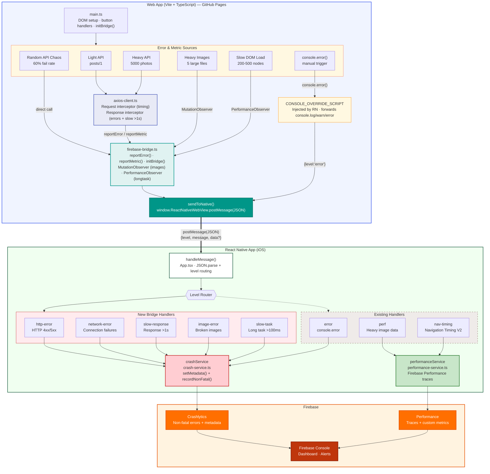

# ErrorTrackingDemo — React Native WebView Error & Performance Tracker

React Native iOS app with Firebase Crashlytics integration for tracking:

- **Crash errors** — Fatal crashes via `crashlytics().crash()`
- **Non-fatal errors** — Handled exceptions reported via `CrashService`
- **WebView errors** — Navigation failures captured via WebView `onError`
- **JS console bridge** — Captures `console.log/warn/error` from WebView content
- **WebView error bridge** — Structured error reporting from web app (HTTP, network, image, slow responses/tasks)
- **Performance** — App startup, WebView page load, Navigation Timing V2 with Firebase Performance traces
- **Heavy images** — PerformanceObserver detects slow/large image loads

> **Legacy MAUI version** is preserved in `maui-app/` for reference.

## Architecture Diagram



## Message Protocol

The web app sends structured JSON via `postMessage()`:

```json
{
  "level": "http-error | network-error | slow-response | image-error | slow-task",
  "message": "Human-readable description",
  "data": {
    "url": "https://...",
    "status": 500,
    "method": "GET",
    "durationMs": 1234
  }
}
```

## Prerequisites

- Node.js >= 22
- Xcode 16+
- CocoaPods
- Firebase project with iOS app registered and Crashlytics enabled

## Setup

1. Clone this repository
2. Download `GoogleService-Info.plist` from Firebase Console
3. Place it at `react-native-app/ios/ErrorTrackingDemo/GoogleService-Info.plist`
4. Install and run:

```bash
cd react-native-app
npm install
cd ios && pod install && cd ..
npx react-native run-ios
```

## Project Structure

```
react-native-app/
├── App.tsx                     # Main screen: WebView + crash buttons + message handler
├── index.js                    # Entry point
├── services/
│   ├── crash-service.ts        # Firebase Crashlytics wrapper (log, recordNonFatal, metadata)
│   ├── performance-service.ts  # Startup, page load, Nav Timing V2, Firebase Perf traces
│   └── download-service.ts     # Download progress & throughput tracking
└── ios/
    ├── Podfile                 # CocoaPods with Firebase
    └── ErrorTrackingDemo/
        ├── AppDelegate.swift   # FirebaseApp.configure()
        └── GoogleService-Info.plist.template
```

## Crashlytics Keys Reference

| Key | Description |
|-----|-------------|
| `startup_ms` | App startup duration |
| `last_page_load_url` | Most recent WebView URL |
| `last_page_load_ms` | Page load wall-clock time |
| `js_ttfb_ms` | Time to first byte |
| `js_dom_interactive_ms` | Browser DOM interactive time |
| `js_dom_complete_ms` | Browser DOM complete time |
| `js_load_event_ms` | Browser load event time |
| `webview_error_code` | WebView error code |
| `http_error_status` | HTTP error status code |
| `http_error_url` | Failed HTTP request URL |
| `http_error_method` | HTTP method (GET/POST/etc.) |
| `network_error_url` | Network failure URL |
| `slow_response_url` | Slow response URL |
| `slow_response_ms` | Slow response duration |
| `image_error_url` | Failed image URL |
| `slow_task_ms` | Long task duration |
| `heavy_image_url` | Slow/large image URL |
| `heavy_image_duration_ms` | Image load duration |
| `heavy_image_size_kb` | Image transfer size |
