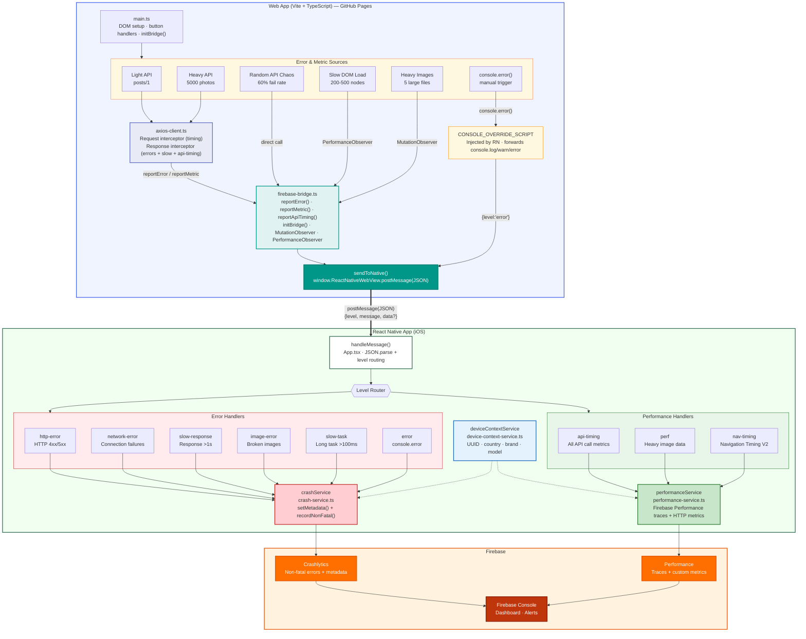

# ErrorTrackingDemo — React Native WebView Error & Performance Tracker

React Native iOS app with Firebase Crashlytics integration for tracking:

- **Crash errors** — Fatal crashes via `crashlytics().crash()`
- **Non-fatal errors** — Handled exceptions reported via `CrashService`
- **WebView errors** — Navigation failures captured via WebView `onError`
- **JS console bridge** — Captures `console.log/warn/error` from WebView content
- **WebView error bridge** — Structured error reporting from web app (HTTP, network, image, slow responses/tasks)
- **API load time** — All WebView API calls tracked as Firebase Performance HTTP metrics
- **Performance** — App startup, WebView page load, Navigation Timing V2 with Firebase Performance traces
- **Heavy images** — PerformanceObserver detects slow/large image loads
- **Device context** — User UUID, country ISO, brand, device model attached to all traces and Crashlytics metadata

> **Legacy MAUI version** is preserved in `maui-app/` for reference.

## Architecture Diagram



## Firebase Metrics: Standard vs Custom

| Product | Type | Metric | Description |
|---------|------|--------|-------------|
| Crashlytics | Standard | Fatal crashes | Stack traces, device info, OS version |
| Crashlytics | Standard | Crash-free users % | Auto-calculated from crash data |
| Crashlytics | Standard | Breadcrumb timeline | Auto-collected app lifecycle events |
| Crashlytics | **Custom** | 25 metadata keys | `setAttribute()` — startup_ms, http_error_status, js_ttfb_ms, user_uuid, country_iso, brand, device_model, etc. |
| Crashlytics | **Custom** | 7 non-fatal error types | `recordError()` — JS errors, HTTP, network, slow response, image, slow task, WebView nav |
| Crashlytics | **Custom** | Breadcrumb logs | `log()` — "WebView load complete", "Nav timing [...]", etc. |
| Performance | Standard | App start time | Auto-collected app startup duration |
| Performance | Standard | HTTP/S network requests | Auto-collected latency, payload size, success rate |
| Performance | Standard | Screen rendering | Slow/frozen frames (Android only) |
| Performance | **Custom** | `webview_page_load` trace | 1 trace with 4 metrics + 5 attributes: `ttfb_ms`, `dom_interactive_ms`, `dom_complete_ms`, `total_load_ms`; attrs: `url`, `user_uuid`, `country_iso`, `brand`, `device_model` |
| Performance | **Custom** | WebView API HTTP metrics | `newHttpMetric()` per API call — url, method, status, duration, payload size + device context attrs |
| Analytics | Standard | Session & engagement | `first_open`, `session_start`, `screen_view`, retention |
| Analytics | **Custom** | *(none)* | Auto-collection only — no custom events needed for this demo |

## Message Protocol

The web app sends structured JSON via `postMessage()`:

```json
{
  "level": "http-error | network-error | slow-response | image-error | slow-task | api-timing",
  "message": "Human-readable description",
  "data": {
    "url": "https://...",
    "status": 500,
    "method": "GET",
    "durationMs": 1234,
    "responseSize": 2048
  }
}
```

## Prerequisites

- Node.js >= 22
- Xcode 16+
- CocoaPods
- Firebase project with iOS app registered and Crashlytics enabled

## Setup

1. Clone this repository
2. Download `GoogleService-Info.plist` from Firebase Console
3. Place it at `react-native-app/ios/ErrorTrackingDemo/GoogleService-Info.plist`
4. Install and run:

```bash
cd react-native-app
npm install
cd ios && pod install && cd ..
npx react-native run-ios
```

## Documentation

- [Error & Log Handling from WebView](react-native-app/docs/error-and-log-handling-from-webview.md) — JS bridge architecture, message protocol, routing, and Crashlytics metadata reference

## Project Structure

```
react-native-app/
├── App.tsx                     # Main screen: WebView + crash buttons + message handler
├── index.js                    # Entry point
├── services/
│   ├── crash-service.ts        # Firebase Crashlytics wrapper (log, recordNonFatal, metadata)
│   ├── performance-service.ts  # Startup, page load, Nav Timing V2, Firebase Perf traces
│   ├── device-context-service.ts # Device context: user UUID, country ISO, brand, device model
│   └── download-service.ts     # Download progress & throughput tracking
└── ios/
    ├── Podfile                 # CocoaPods with Firebase
    └── ErrorTrackingDemo/
        ├── AppDelegate.swift   # FirebaseApp.configure()
        └── GoogleService-Info.plist.template
```

## Crashlytics Keys Reference

| Key | Description |
|-----|-------------|
| `startup_ms` | App startup duration |
| `last_page_load_url` | Most recent WebView URL |
| `last_page_load_ms` | Page load wall-clock time |
| `js_ttfb_ms` | Time to first byte |
| `js_dom_interactive_ms` | Browser DOM interactive time |
| `js_dom_complete_ms` | Browser DOM complete time |
| `js_load_event_ms` | Browser load event time |
| `webview_error_code` | WebView error code |
| `http_error_status` | HTTP error status code |
| `http_error_url` | Failed HTTP request URL |
| `http_error_method` | HTTP method (GET/POST/etc.) |
| `network_error_url` | Network failure URL |
| `slow_response_url` | Slow response URL |
| `slow_response_ms` | Slow response duration |
| `image_error_url` | Failed image URL |
| `slow_task_ms` | Long task duration |
| `heavy_image_url` | Slow/large image URL |
| `heavy_image_duration_ms` | Image load duration |
| `heavy_image_size_kb` | Image transfer size |
| `user_uuid` | Persistent random UUID per device (first launch) |
| `country_iso` | Country ISO from device locale (e.g., "US", "VN") |
| `brand` | Commercial brand (e.g., "Brand A", "Brand B") |
| `device_model` | Device model (e.g., "iPhone 15 Pro") |

## References

- [Demo WebView error source code](https://github.com/phucsystem/demo-web-view-error) — Web app loaded in the WebView for error and performance testing
- [Set up alerts for performance issues (Firebase)](https://firebase.google.com/docs/perf-mon/alerts) — Configure alerts for metric regressions in Firebase Performance Monitoring
- [App start, foreground, background traces (Firebase)](https://firebase.google.com/docs/perf-mon/app-start-foreground-background-traces?platform=ios) — Auto-collected app lifecycle performance traces on iOS
- [Screen rendering performance traces (Firebase)](https://firebase.google.com/docs/perf-mon/screen-traces?platform=ios) — Monitor slow and frozen frames per screen on iOS
