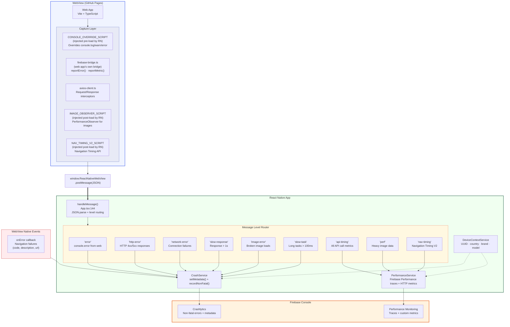

# Error & Log Handling from WebView

## Overview

The app captures errors and logs from a WebView-hosted web app using a **JavaScript bridge** pattern. The web app runs on GitHub Pages and communicates with React Native via `postMessage()`. All captured data flows to Firebase Crashlytics (errors) and Firebase Performance (metrics).

## Firebase Products Summary

| Product | Status | What It Captures |
|---------|--------|-----------------|
| Crashlytics | Active, heavily used | Non-fatal errors, metadata, breadcrumb logs |
| Performance | Active, heavily used | Traces (page load, nav timing), custom metrics |
| Analytics | Installed + auto-collection ON | Screen views, app open/close — nothing custom yet |

## Architecture Diagram



## How It Works

### Step 1: Script Injection

React Native injects three scripts into the WebView at different lifecycle stages:

| Script | When Injected | Purpose |
|--------|--------------|---------|
| `CONSOLE_OVERRIDE_SCRIPT` | **Before page load** (`injectedJavaScript` prop) | Monkey-patches `console.log/warn/error` to forward output via `postMessage()` |
| `IMAGE_OBSERVER_SCRIPT` | **After page load** (`onLoadEnd` callback) | Creates `PerformanceObserver` for `resource` entries; reports images >500ms or >200KB |
| `NAV_TIMING_V2_SCRIPT` | **After page load** (`onLoadEnd` callback) | Reads `performance.getEntriesByType('navigation')` and sends TTFB, DOM timing metrics |

### Step 2: Web App Error Sources

The web app generates errors/metrics from multiple sources:

```
Web App Error Sources
├── Console Override (RN-injected)
│   └── console.error() → level: "error"
│
├── Axios Interceptors (web app)
│   ├── HTTP 4xx/5xx → level: "http-error"
│   ├── Network failures → level: "network-error"
│   └── Slow responses (>1s) → level: "slow-response"
│
├── MutationObserver (web app)
│   └── Broken images → level: "image-error"
│
├── PerformanceObserver (web app)
│   └── Long tasks (>100ms) → level: "slow-task"
│
├── Image Observer (RN-injected)
│   └── Heavy images (>500ms or >200KB) → level: "perf"
│
└── Navigation Timing (RN-injected)
    └── Page load timing → level: "nav-timing"
```

### Step 3: Message Protocol

All messages use the same JSON structure via `postMessage()`:

```json
{
  "level": "error | http-error | network-error | slow-response | image-error | slow-task | api-timing | perf | nav-timing | log | warn",
  "message": "Human-readable description or JSON-encoded data",
  "data": {
    "url": "https://...",
    "status": 500,
    "method": "GET",
    "durationMs": 1234,
    "responseSize": 2048
  }
}
```

The `data` field is optional and used by structured error types (http-error, network-error, slow-response, image-error, slow-task, api-timing).

### Step 4: Message Routing in React Native

`handleMessage()` in `App.tsx` parses incoming JSON and routes by `level`:

```
handleMessage(event)
│
├── Parse JSON payload
├── Validate: must have level + message
├── Log to console + Crashlytics log buffer
│
├── level === "api-timing"
│   └── Create Firebase HTTP metric → performanceService.recordApiTiming()
│
├── level === "nav-timing"
│   └── Parse timing data → performanceService.recordNavigationTiming()
│
├── level === "perf"
│   └── Parse image data → performanceService.recordHeavyImageLoad()
│
├── level === "error"
│   └── Truncate to 128 chars → crashService.recordNonFatal()
│
├── level === "http-error"
│   └── Set metadata (status, url, method) → crashService.recordNonFatal()
│
├── level === "network-error"
│   └── Set metadata (url) → crashService.recordNonFatal()
│
├── level === "slow-response"
│   └── Set metadata (url, durationMs) → crashService.recordNonFatal()
│
├── level === "image-error"
│   └── Set metadata (url) → crashService.recordNonFatal()
│
└── level === "slow-task"
    └── Set metadata (durationMs) → crashService.recordNonFatal()
```

### Step 5: WebView Native Error Handling

Separate from the JS bridge, the WebView `onError` callback captures **navigation-level failures** (DNS, SSL, connection errors):

```
WebView onError
│
├── Ignore code -999 (user cancelled navigation)
├── Stop active performance trace
├── Set metadata: webview_error_code, webview_url
└── crashService.recordNonFatal() with context "WebView.onError"
```

## Data Flow Summary

```
┌─────────────────────────────────────────────────────────────────┐
│                        WebView (Web App)                        │
│                                                                 │
│  console.error() ──┐                                            │
│  HTTP errors ──────┤                                            │
│  Network fails ────┤  postMessage(JSON)                         │
│  Slow responses ───┼──────────────────────┐                     │
│  Broken images ────┤                      │                     │
│  Long tasks ───────┤                      │                     │
│  Heavy images ─────┤                      │                     │
│  Nav timing ───────┘                      │                     │
└───────────────────────────────────────────┼─────────────────────┘
                                            │
                                            ▼
┌─────────────────────────────────────────────────────────────────┐
│                    React Native (handleMessage)                  │
│                                                                 │
│  ┌──────────────────────┐    ┌────────────────────────────────┐ │
│  │   Error Messages     │    │   Performance Messages         │ │
│  │                      │    │                                │ │
│  │  error               │    │  nav-timing                    │ │
│  │  http-error          │    │  perf (heavy images)           │ │
│  │  network-error       │    │                                │ │
│  │  slow-response       │    │         │                      │ │
│  │  image-error         │    │         ▼                      │ │
│  │  slow-task           │    │  PerformanceService            │ │
│  │         │            │    │  → Firebase Performance traces │ │
│  │         ▼            │    │  → Crashlytics metadata        │ │
│  │  CrashService        │    └────────────────────────────────┘ │
│  │  → setMetadata()     │                                       │
│  │  → recordNonFatal()  │    ┌────────────────────────────────┐ │
│  └──────────────────────┘    │  WebView onError (native)      │ │
│                              │  → Navigation failures         │ │
│                              │  → CrashService.recordNonFatal │ │
│                              └────────────────────────────────┘ │
└─────────────────────────────────────────────────────────────────┘
                          │                    │
                          ▼                    ▼
                ┌──────────────────┐  ┌────────────────┐
                │   Crashlytics    │  │  Performance   │
                │   Non-fatals +   │  │  Traces +      │
                │   metadata keys  │  │  custom metrics │
                └──────────────────┘  └────────────────┘
                          │                    │
                          ▼                    ▼
                ┌──────────────────────────────────────┐
                │        Firebase Console Dashboard     │
                └──────────────────────────────────────┘
```

## Crashlytics Metadata Keys

| Key | Set By | Description |
|-----|--------|-------------|
| `startup_ms` | PerformanceService | App startup duration |
| `webview_init_load_ms` | PerformanceService | Initial WebView load time |
| `webview_init_total_ms` | PerformanceService | Total time from app start to first WebView load |
| `last_page_load_url` | PerformanceService | Most recent WebView URL loaded |
| `last_page_load_ms` | PerformanceService | Page load wall-clock time |
| `js_ttfb_ms` | PerformanceService | Time to first byte (Navigation Timing) |
| `js_dom_interactive_ms` | PerformanceService | DOM interactive time |
| `js_dom_complete_ms` | PerformanceService | DOM complete time |
| `js_load_event_ms` | PerformanceService | Load event end time |
| `heavy_image_url` | PerformanceService | Slow/large image URL |
| `heavy_image_duration_ms` | PerformanceService | Image load duration |
| `heavy_image_size_kb` | PerformanceService | Image transfer size |
| `webview_error_code` | handleError | WebView navigation error code |
| `webview_url` | handleError | URL that failed to load |
| `last_js_error` | handleMessage | Last console.error message (truncated 128 chars) |
| `http_error_status` | handleMessage | HTTP error status code |
| `http_error_url` | handleMessage | Failed HTTP request URL |
| `http_error_method` | handleMessage | HTTP method of failed request |
| `network_error_url` | handleMessage | URL of network failure |
| `slow_response_url` | handleMessage | URL of slow response |
| `slow_response_ms` | handleMessage | Slow response duration |
| `image_error_url` | handleMessage | URL of broken image |
| `slow_task_ms` | handleMessage | Long task duration |

## Design Decisions

1. **JS bridge over native WebView delegates** — All error capture via injected JavaScript and `postMessage()`. No custom iOS/Android WebView delegates. Simpler cross-platform code at the cost of not intercepting low-level network/SSL errors natively.

2. **Guard pattern on services** — `CrashService.isEnabled` flag ensures graceful degradation when Firebase is unavailable (e.g., missing `GoogleService-Info.plist`).

3. **URL truncation to 128 chars** — Prevents Crashlytics metadata bloat from long URLs.

4. **Separate pre-load and post-load injection** — Console override must run before web content executes; image/timing observers need the page loaded first.

5. **Code -999 filtering** — iOS WebKit fires error code -999 for user-cancelled navigations; these are ignored to avoid noise.
